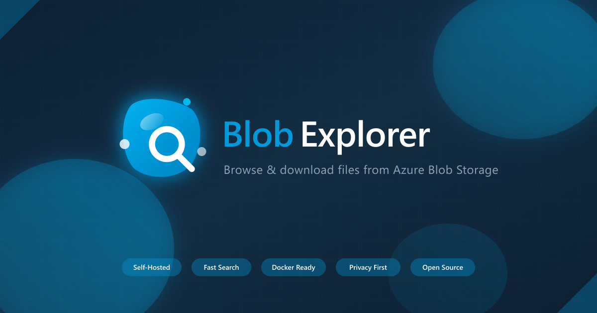

# Blob Explorer

<p align="center">
  
</p>

<p align="center">
  A self-hosted web interface for browsing and downloading files from any public Azure Blob Storage container.
</p>

<p align="center">
  <a href="https://github.com/joshooaj/blobexplorer/pkgs/container/blobexplorer"></a>
  <a href="https://hub.docker.com/r/joshooaj/blobexplorer"></a>
  <a href="LICENSE"></a>
</p>

---

## Features

- **Fast Navigation** — Hierarchical folder tree with O(1) lookups for 100K+ files
- **Powerful Search** — Instant search with wildcard and regex support
- **Favorites** — Pin folders or searches for quick access
- **File Type Filtering** — Filter by installers, PDFs, ZIPs, and more
- **Dark Mode** — Automatic theme detection with manual toggle
- **Responsive** — Desktop and mobile friendly
- **Accessible** — Keyboard navigation, screen reader support, skip links
- **Self-Contained** — No external dependencies; all assets self-hosted
- **Smart Caching** — Server-side and browser-side (IndexedDB) caching for fast loads
- **Analytics Ready** — Hook into any analytics provider via custom events

---

## Getting Started

You can run Blob Explorer two ways:

### Option 1: Pull from Docker Hub

Create a `docker-compose.yaml`:

```yaml
services:
  blob-explorer:
    image: joshooaj/blobexplorer:latest
    container_name: blob-explorer
    ports:
      - "8080:8080"
    volumes:
      - ./config:/config
      - blob-cache:/cache
    environment:
      - BASE_URL=https://myaccount.blob.core.windows.net/mycontainer
    restart: unless-stopped

volumes:
  blob-cache:
```

```bash
docker compose up -d
```

### Option 2: Clone and Build

```bash
git clone https://github.com/joshooaj/blobexplorer.git
cd blobexplorer
```

Set your `BASE_URL` in a `docker-compose.override.yaml`:

```yaml
services:
  blob-explorer:
    ports:
      - "8080:8080"
    environment:
      - BASE_URL=https://myaccount.blob.core.windows.net/mycontainer
```

```bash
docker compose up -d --build
```

Then open **http://localhost:8080** in your browser.

---

## Configuration

### Environment Variables

| Variable | Required | Default | Description |
|----------|----------|---------|-------------|
| `BASE_URL` | **Yes** | — | Azure Blob Storage container URL |
| `DOWNLOAD_BASE` | No | Same as `BASE_URL` | Alternative download URL (e.g., CDN or Front Door) |
| `SITE_TITLE` | No | `Blob Explorer` | Title shown in header and browser tab |
| `SITE_DESCRIPTION` | No | `Browse and download files...` | Meta description |
| `LOGO_URL` | No | Default logo | URL to a custom logo image |
| `LOGO_FILE` | No | — | Path to a logo file relative to `/config` (e.g., `my-logo.svg`) |
| `UPDATE_INTERVAL` | No | `86400` | Seconds between blob list refreshes (default: 24h) |
| `ALLOW_CUSTOM_URL` | No | `false` | Allow users to browse any blob storage URL via settings |
| `TZ` | No | `UTC` | Timezone for timestamps |

### Config File

On first run, a default `config.json` is created in your `/config` volume. Edit it to customize favorites, analytics, and more. Environment variables take precedence over config file values.

```json
{
  "$schema": "./config.schema.json",
  "siteTitle": "My Downloads",
  "siteDescription": "Browse and download files",
  "logoUrl": "",
  "analyticsScript": "analytics.html",
  "favorites": [
    {
      "label": "Recent Releases",
      "type": "folder",
      "path": "releases/2024"
    },
    {
      "label": "Documentation",
      "type": "search",
      "query": "\\.pdf$"
    },
    {
      "label": "Latest Versions",
      "type": "pattern",
      "pattern": "^v\\d+\\.\\d+",
      "limit": 3,
      "sortOrder": "desc"
    }
  ]
}
```

A `config.schema.json` is included for editor autocompletion and validation.

#### Favorite Types

| Type | Description | Required Fields |
|------|-------------|-----------------|
| `folder` | Navigate to a folder path | `path` |
| `search` | Run a regex search query | `query` |
| `pattern` | Auto-match folders by regex | `pattern`, optional `limit` and `sortOrder` |

### Reverse Proxy (Traefik)

```yaml
services:
  blob-explorer:
    # ... other config ...
    networks:
      - web
    labels:
      - "traefik.enable=true"
      - "traefik.http.routers.blob-explorer.entrypoints=https"
      - "traefik.http.routers.blob-explorer.rule=Host(`downloads.example.com`)"
      - "traefik.http.services.blob-explorer.loadbalancer.server.port=8080"

networks:
  web:
    external: true
```

---

## Analytics

Blob Explorer dispatches custom events that you can hook into with any analytics provider.

### Setup

1. Create an analytics file in your config folder
2. Reference it in `config.json`:

```json
{ "analyticsScript": "analytics.html" }
```

**File formats:**
- `.js` — plain JavaScript, auto-wrapped in `<script>` tags
- `.html` — injected as-is (use when loading external scripts via `<script src="...">`)

### Events

| Event | Detail Properties |
|-------|-------------------|
| `blob-explorer:page-view` | `path`, `url`, `timestamp` |
| `blob-explorer:search` | `query`, `resultCount`, `timestamp` |
| `blob-explorer:download` | `fileName`, `filePath`, `fileSize`, `fileType`, `timestamp` |
| `blob-explorer:copy-link` | `fileName`, `filePath`, `timestamp` |
| `blob-explorer:folder-navigate` | `folderPath`, `folderName`, `timestamp` |
| `blob-explorer:filter-change` | `activeFilters`, `totalFilters`, `timestamp` |
| `blob-explorer:theme-change` | `theme`, `timestamp` |
| `blob-explorer:favorite-add` / `favorite-remove` | `label`, `type`, `path`, `timestamp` |

<details>
<summary><strong>Example: Google Analytics 4</strong></summary>

Create `./config/analytics.html`:

```html
<script async src="https://www.googletagmanager.com/gtag/js?id=G-XXXXXXXXXX"></script>
<script>
  window.dataLayer = window.dataLayer || [];
  function gtag() { dataLayer.push(arguments); }
  gtag('js', new Date());
  gtag('config', 'G-XXXXXXXXXX');

  document.addEventListener('blob-explorer:download', (e) => {
    gtag('event', 'download', {
      file_name: e.detail.fileName,
      file_type: e.detail.fileType,
      file_size: e.detail.fileSize
    });
  });

  document.addEventListener('blob-explorer:search', (e) => {
    gtag('event', 'search', { search_term: e.detail.query });
  });
</script>
```

```json
{ "analyticsScript": "analytics.html" }
```

</details>

<details>
<summary><strong>Example: Plausible</strong></summary>

Create `./config/analytics.html`:

```html
<script async src="https://plausible.io/js/script.js"></script>
<script>
  window.plausible = window.plausible || function() { (plausible.q = plausible.q || []).push(arguments) };

  document.addEventListener('blob-explorer:download', (e) => {
    plausible('Download', { props: { file: e.detail.fileName, type: e.detail.fileType } });
  });

  document.addEventListener('blob-explorer:search', (e) => {
    plausible('Search', { props: { query: e.detail.query, results: String(e.detail.resultCount) } });
  });

  document.addEventListener('blob-explorer:folder-navigate', (e) => {
    const baseUrl = window.location.protocol + '//' + window.location.hostname;
    const segments = e.detail.folderPath.split('/').filter(Boolean).map(encodeURIComponent);
    const virtualPath = segments.length ? '/folder/' + segments.join('/') + '/' : '/';
    plausible('pageview', { u: baseUrl + virtualPath });
  });
</script>
```

```json
{ "analyticsScript": "analytics.html" }
```

</details>

<details>
<summary><strong>Example: Simple Event Logging</strong></summary>

Create `./config/analytics.js`:

```javascript
document.addEventListener('blob-explorer:download', (e) => {
  console.log('Download:', e.detail.fileName, e.detail.fileSize);
});

document.addEventListener('blob-explorer:search', (e) => {
  console.log('Search:', e.detail.query, 'Results:', e.detail.resultCount);
});
```

Plain `.js` files are automatically wrapped in `<script>` tags.

</details>

---

## Architecture

Blob Explorer runs as a single Docker container:

1. **nginx** serves the static site on port 8080
2. A **background updater** periodically fetches the blob list from Azure Storage
3. **Runtime config** is generated from `config.json` + environment variables at startup
4. **Cached data** in `/cache` enables instant startup on container restart

### Volumes

| Mount Point | Purpose |
|-------------|---------|
| `/config` | Configuration (`config.json`, logos, analytics scripts) |
| `/cache` | Blob data cache for fast startup |

### How It Works

1. On startup, the container creates `/config/config.json` from defaults if missing
2. ENV vars are merged with config file values (ENV takes precedence)
3. Cached blob data in `/cache` is served immediately while stale data refreshes in the background
4. The browser caches data in IndexedDB for fast subsequent page loads
5. The blob list refreshes automatically based on `UPDATE_INTERVAL`

---

## Requirements

- Public Azure Blob Storage container with anonymous read access
- Docker and Docker Compose

## License

MIT
